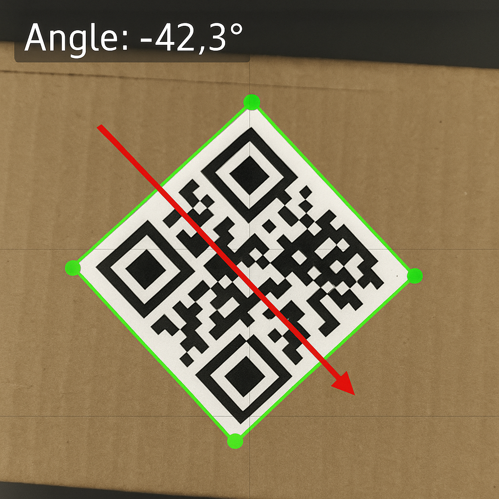
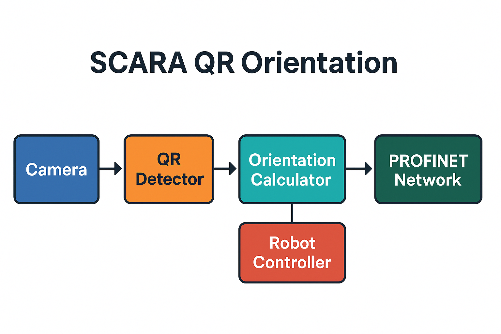

# SCARA QR Orientation
*Real-time orientation tracking of a QR code mounted on a SCARA robot gripper*  



---

## ✨ Why?
- **Accurate pick-and-place** – computes the QR plate’s absolute rotation so the gripper can compensate its offset before every packaging cycle.  
- **Zero-touch** – no manual calibration; the camera does the work.  
- **Industrial-ready** – architecture designed for a future **PROFINET** pipeline, enabling deterministic data exchange with PLCs or the robot controller.

---

## 🚀 Features
| Feature | Status |
|---------|--------|
| Live QR pose estimation (≤ 10 ms)    | ✅ |
| Automatic camera re-init on failure  | ✅ |
| Rich logging to file **and** console | ✅ |
| Single-file implementation           | ✅ |
| PROFINET publisher                   | ⏳ _road-map_ |

---

## 🖼️ Architecture


1. **Camera** streams frames (USB 3.0 / GigE).  
2. **QR Detector** (`cv2.QRCodeDetector`) finds the four corner points.  
3. **Orientation Calculator** derives the leading edge vector and converts `atan2` to degrees [–180°, +180°].  
4. **Robot Controller** receives the angle and rotates the gripper.  
5. **PROFINET Network** (road-map) broadcasts the value to the PLC.

---

## 📂 Repository structure
```
scara-qr-orientation/
├── README.md
├── LICENSE                 # MIT
├── requirements.txt
├── src/
│   └── detector.py         # ← QR - orientation detector (renamed)
├── sample_logs/
│   └── qr_detection.log    # example run (see below)
└── docs/
    └── images/
        ├── pipeline_overview.png
        ├── demo_detection_-42deg.png
        └── demo_detection_+17deg.png
```

---

## 🏁 Quick start
```bash
# clone
git clone https://github.com/GPioldi/scara-qr-orientation.git
cd scara-qr-orientation

# environment
python3 -m venv .venv && source .venv/bin/activate
pip install -r requirements.txt

# run (defaults to /dev/video0)
python src/detector.py --camera-index 0
```
Press **q** in the preview window to exit gracefully.

---

## ⚙️ Command-line flags
| Flag / Env var     | Default | Description               |
|--------------------|---------|---------------------------|
| `--camera-index`   | `0`     | `cv2.VideoCapture` index  |
| `--log-level`      | `INFO`  | `DEBUG`, `INFO`, `WARNING`, … |
| `--attempts`       | `5`     | Re-tries before hard exit |
| `--delay`          | `5` s   | Wait between attempts     |
| `PROFINET_DEST_IP` | –       | Target PLC address (_future_) |

---

## 📑 Example log excerpt
Below are the first lines of `sample_logs/qr_detection.log`, captured on **2025-03-20** with a cardboard target and two manual rotations of the gripper:

```text
2025-03-20 20:12:09,907 INFO: Camera opened successfully on index 0.
2025-03-20 20:12:09,908 INFO: Starting main loop. Press 'q' in the display window to quit.
2025-03-20 20:12:27,325 INFO: Angle: -18.12 deg
2025-03-20 20:12:27,682 INFO: Angle:  80.77 deg
2025-03-20 20:12:27,791 INFO: Angle:  80.50 deg
2025-03-20 20:12:27,896 INFO: Angle:  81.36 deg
...
```
The file keeps growing during runtime and can be parsed offline for statistics or troubleshooting.

---

## 🛣 Road map
- [ ] Add camera calibration & lens-distortion removal  
- [ ] Publish angle via OPC-UA for wider compatibility  
- [ ] Native PROFINET module for soft-PLC demo  
- [ ] Dockerfile & VS Code Dev Container  

---

## 🤝 Contributing
Small project, big welcomes! Open an issue for proposals, or fork and submit a pull-request.  

> Enjoy building smarter SCARA pickers!

---

## 📝 License
Released under the **MIT License** – see `LICENSE` for full text.

